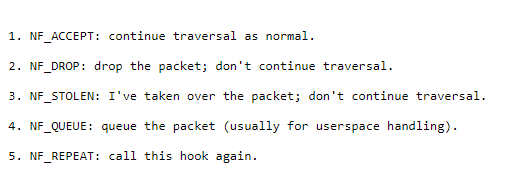

## First Module

 Yaniv is using mint cinnamon linux
and Lubaba using a clean ubunto image

from:
sysprog21.github.io/lkmpg

```bash
sudo apt-get update
```

```bash
sudo apt-get install kmod linux-headers-5.4.0-80-generic
```

it was needed to restart the vm after installing the headers for linux/init
to not throw compiliation error

created the make file with the given instruction

```bash
obj-m += first_module.o

all:
	make -C /lib/modules/$(shell uname -r)/build M=$(PWD) modules

clean:
	make -C /lib/modules/$(shell uname -r)/build M=$(PWD) clean
```

than did:

```bash
sudo insmod first_module.ko
```

```bash
dmesg | tail
```

[ 1026.162937] Basic Module: Loaded successfully!

```bash
sudo rmmod first_module
```

[ 1141.683887] Basic Module: Unloaded successfully!

now we can clean that make file cus it really disgusting

```bash
make clean
```

in order to push in this linux we must setup:
 git config --global user.email "you@example.com"
  git config --global user.name "Your Name"

## Second Module

  important explanation on every part of the example code

 ```c
  static unsigned int packet_hook(void *priv, struct sk_buff *skb, const struct nf_hook_state *state) {
    printk(KERN_INFO "Netfilter Module: Packet intercepted.\n");
    return NF_ACCEPT; // Accept the packet to continue its path
}
```

## Function Signature

The hook function must match a specific signature defined by Netfilter to be compatible with the framework.

- **priv**: A pointer to private data, not used here.
- **skb**: A pointer to the `struct sk_buff` which represents the network packet, skb stands for "socket buffer".
- **state**: Contains information about the packet and the hook point.
- **printk**: Logs a message each time a packet is processed by this hook.
- **Return Value**: `NF_ACCEPT` tells Netfilter to allow the packet to proceed. Other values like `NF_DROP` can be used to drop the packet.
for more info i found this source:

[netfilter-hacking-HOWTO](https://www.netfilter.org/documentation/HOWTO/netfilter-hacking-HOWTO.txt)




```c
static struct nf_hook_ops nfho = {
    .hook = packet_hook,           // Pointer to the hook function
    .pf = PF_INET,                 // IPv4 protocol family
    .hooknum = NF_INET_PRE_ROUTING, // First hook in Netfilter IPv4 (when packet arrives)
    .priority = NF_IP_PRI_FIRST,   // Set the highest priority over all other hook functions
};
```

- **hook**: This is a pointer to the function to call when the conditions are met.
- **pf**: Protocol family, set to `PF_INET` for IPv4. For IPv6, you would use `PF_INET6`.

IPv4 and IPv6 are two different versions of the Internet Protocol. They are both used to send packets of data across the Internet. The main difference between IPv4 and IPv6 is the number of IP addresses they can support. 
IPv4 using 32 bits, IPv6 using 128 bits.
there are also more differnces between them,security, routing, and network configuration.
You can read more about it [Understanding the Difference Between IPv4 and IPv6](https://www.siteground.com/kb/ipv4-vs-ipv6/#Understanding_IPv4_and_IPv6)

- **hooknum**: Defines at which point in the packet processing this hook will be called. `NF_INET_PRE_ROUTING` is the point just after the packet is received. BASICLY THE LOCATION OF THE FILTER, CHECK THE GRAPH IN THE CHECKPOINT PRESENTATION

- **priority**: Determines the order of calling when multiple hooks exist for the same hook point. IN CASE WE HAVE MULTIPLY HOOKS ON THE SAME SPOT, WHICH ONE SHOULD BE FIRST? LAST?


```c
static int __init my_netfilter_init(void) {
    nf_register_net_hook(&init_net, &nfho); // Register the hook
    printk(KERN_INFO "Netfilter Module: Loaded and hook registered.\n");
    return 0;
}

static void __exit my_netfilter_exit(void) {
    nf_unregister_net_hook(&init_net, &nfho); // Unregister the hook
    printk(KERN_INFO "Netfilter Module: Unloaded and hook unregistered.\n");
}
```

- **nf_register_net_hook & nf_unregister_net_hook**: These functions register and unregister your hook with the Netfilter framework.
- **init_net**: Represents the network namespace; `init_net` is the initial network namespace, basically connect the hook to the default global network of the system.
- **nfho**: The hook structure we defined earlier with the hook and other parameters as described above.

- **Initialization and Cleanup Functions**: Marked with `__init` and `__exit` to indicate to the kernel that these functions are only used at initialization or cleanup time, which can help to save memory.

